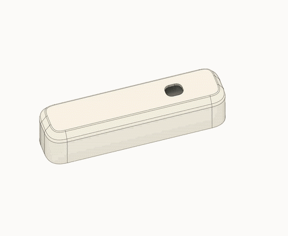

# Zicada - DIY Zigbee Multisensor

## Overview

Zicada is a DIY Zigbee sensor based on Nordic’s nRF52840 SoC. It combines a temperature and humidity sensor with a hall effect switch, making it suitable for both climate and door/window monitoring. Zicada is optimized for ultra-low power consumption, running at just 6µW in standby. This allows it to operate on a rechargeable AAA battery for 2 years or longer. It is fully compatible with Home Assistant (ZHA) and Zigbee2MQTT.

  

### Features
* Temperature, humidity and contact sensing
* Zigbee 3.0 end device
* Compatible with Home Assistant (ZHA) and Zigbee2MQTT
* Ultra-low power consumption (6µW in Standby)
* 2+ years of battery life
* Supports AAA cells from 0.9V to 1.5V
* Small sized (62 x 15 mm) and fully 3D-printed case

### Setup Instructions

Follow these instructions to download and install the nRF Connect SDK version 2.6.0:
https://docs.nordicsemi.com/bundle/ncs-2.6.3/page/nrf/installation/install_ncs.html
Copy Zicada firmware folder into the directory ncs/projects.

When using the contact sensor with Zigbee2MQTT, copy the file "zicada_converter.js" to the directory data/external_converters/ of you Z2M install.